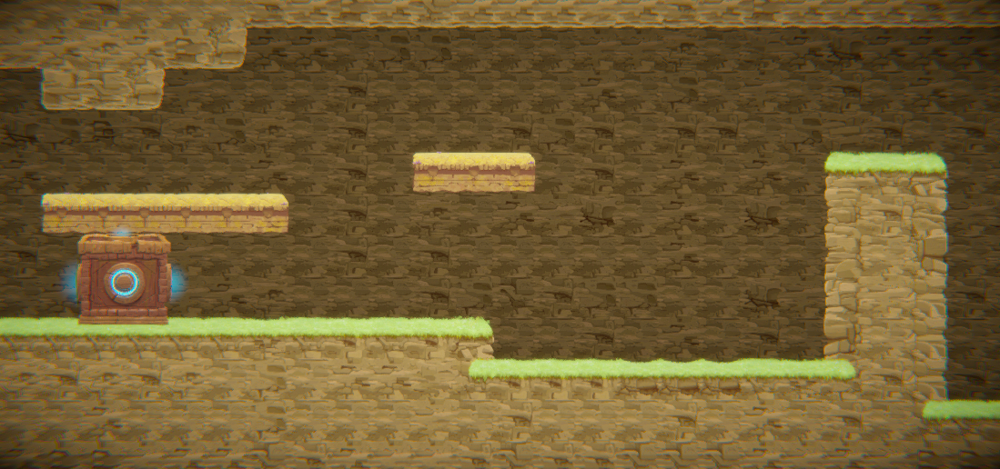
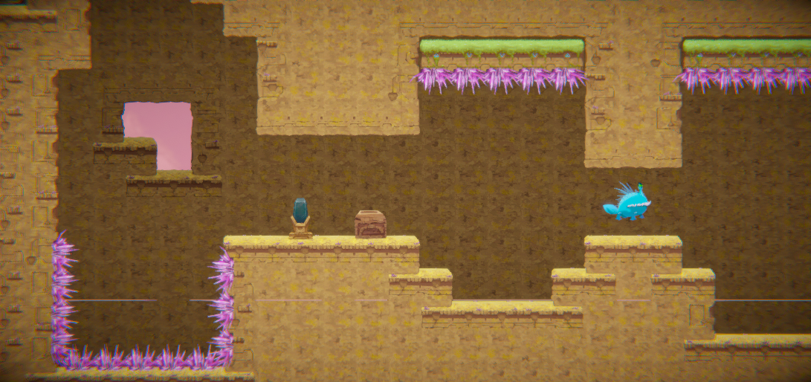
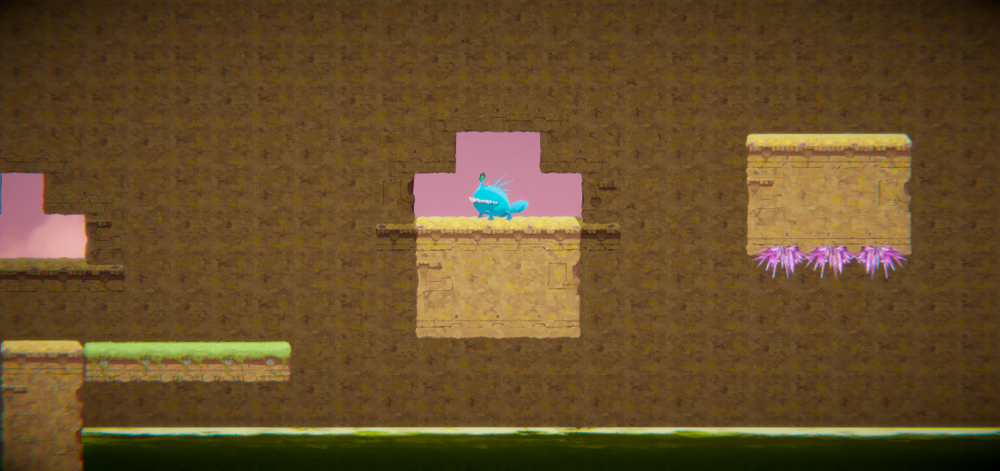
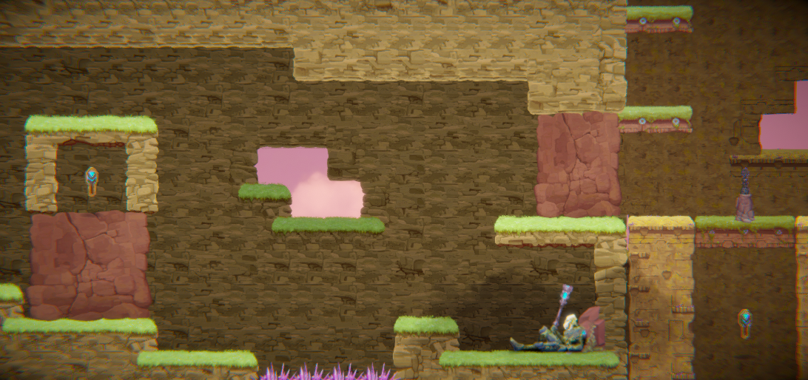
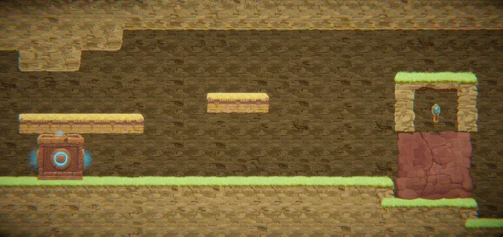
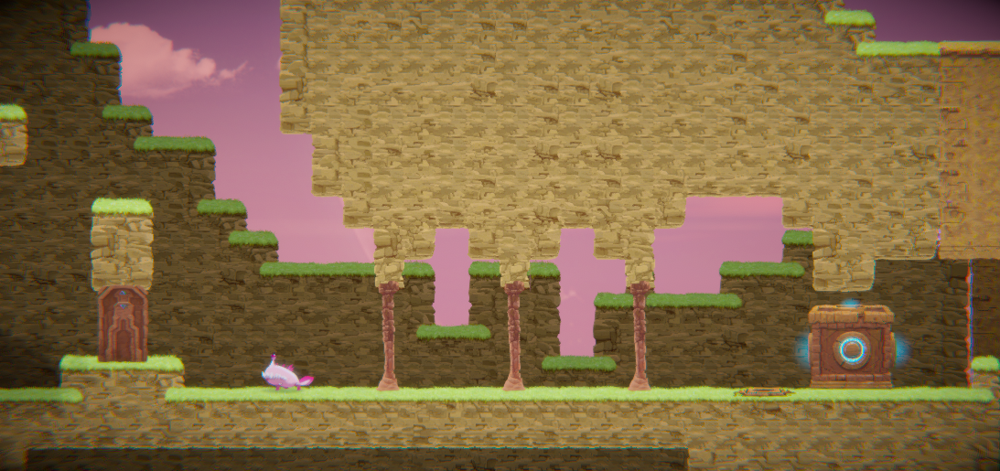
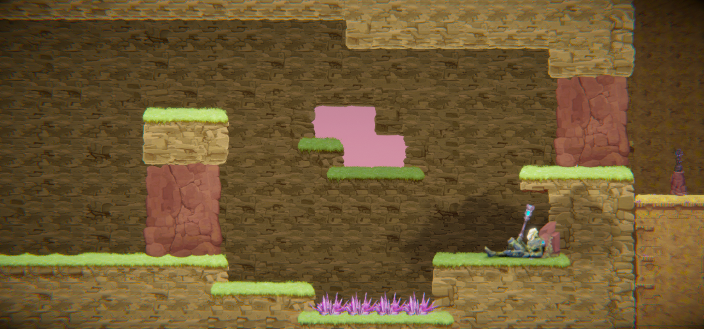

# COMP2150  - Level Design Document
### Name: Alexander Deane
### Student number: 47517514

In my level design document I will discuss and explain how my project achieves the requirements of the assignment specifications with examples found in the level and how I iterated through the design to the final version I have submitted.

## 1. Player Experience (~700 words)

In the below section, I will go into detail explaining my reasoning for using specific design approaches that demonstrate how I have planned my level around core player interactions that give the player target experiences that I wanted to acheive.

### 1.1. Discovery
What does the player learn? How does your encounter and broader level design facilitate learning in a way that follows good design practice?

Throughout my level I have created puzzles and obstacles for the player to overcome and solve, these puzzles act as simple barriers that the player must navigate around with a specific or multiple mechanics, or the puzzle will allow the player to get a reward through the keys and health pickups. I have recreated and modified similar puzzles in each section by adding additional stressors such as enemies and spikes which will increase the challenge but also allow the player to discover what mechanics are consistently able to solve puzzles and learn what new mechanics I have intended for them to use in later iterations of the same obstacle.

Below is a puzzle from the first section of my level which requires the player to push a moveable box against a high wall which will create stairs for the player to climb over the tall wall (this is not an up to date image of the level as I changed the design later on).

**(moveable box puzzle to create stairs over wall)**

**(updated moveable box puzzle to create stairs over wall).**

There are no stressors added to this puzzle and I have designed the platforms around the puzzle to prevent the player from soft-locking the level or preventing a sollution from being achievable.

**(same moveable box puzzle to create stairs over wall with added pressure pad and walls)**

**(updated moveable box puzzle to create stairs over wall with added pressure pad and walls).**

By adding walls and a pressure pad the player discovers that debris slows down movement when pushing the box and that the box will activate pressure pads that it slides onto. This is one example of how my level teaches players how each mechanic and object works within the level and facilitates and encourages learning.

### 1.2. Drama
What is the intensity curve? How does your design facilitate increasing yet modulating intensity, with moments of tension and relief? 

Throughout the level I play and experiment with moments of tension and relief in the above gif I use a slow moving spike wall that approaches the player whilst they push a moveable box in order to create a tense moment and increase it from a simple task into a stressful activity. I also create safe areas where the player is able to take breaks with various checkpoints and health pickups around the map.

**(example of safe area after challenging obstacle)**

In the above image is a small safe area after defeating the spitter for the player to rest and call down an elevator with a checkpoint. This area immediately after a tense platforming obstacle gives the player a moment of relief as it modulates intensity.

### 1.3. Challenge
What are the main challenges? How have you designed and balanced these challenges to control the difficulty curve and keep the player in the flow channel?

I have based the level around the theme of an ancient temple or ruined structure with difficult traps and obstacles for the player to face, I had a primary goal on platforming puzzles to be the main challenge that would require precise jumps and quick reactions to stressors with heavy inspiration to Indiana Jones cave traps.

**(image of platforming puzzle in section 2 with inspiration to Indiana Jones)**

platforming obstacles I have implemented in the game have a higher difficulty ceiling than challenges involving hostile mobs as that was my main vision for the level. I have balanced the difficulty curve of these challenges by providing multiple routes to complete these obstacles and given multiple safe areas with health pickups and checkpoints to allow the player to retry if necessary.

### 1.4. Exploration
How does your level design facilitate autonomy and invite the player to explore? How do your aesthetic and layout choices create distinct and memorable spaces and/or places?

Throughout my level I create many loop-backs and areas that allow the player to choose from multiple paths and encourage exploration throughout my level.

**(image of loop-back and multiple paths available for player)**

In the above image, once the player jumps over the wall puzzle in section 1 and retrieves the hammer they are then able to advance towards the key visible in section 2, destroy the wall and retreat back to the start of section 1, or jump up the passthrough platforms up into section 3. Each of these paths are possible to complete and exploring these different locations is encouraged as some paths allow the player to make certain puzzles easier in advance. In the box pushing puzzle found in section 3 the walls must be broken during OR before the challenge starts, If the player moves back towards section 1 after retrieving the hammer they are able to safely destroy the pillars before having to push the box making the obstacle easier to complete.

## 2. Core Gameplay (~400 words)

N/A

### 2.1. Acid

### 2.2. Checkpoints

### 2.3. Chompers

### 2.4. Health Pickups

### 2.5. Keys

### 2.6. Moving Platforms

### 2.7. Passthrough Platforms

### 2.8. Spikes

### 2.9. Spitters

### 2.10. Weapon Pickup (Gun)

### 2.11. Weapon Pickup (Staff)

## 3. Spatiotemporal Design

N/A
 
### 3.1. Molecule Diagram

### 3.2. Level Map – Section 1

### 3.3.	Level Map – Section 2

### 3.4.	Level Map – Section 3

## 4. Iterative Design (~400 words)
Reflect on how iterative design helped to improve your level. Additional prototypes and design artefacts should be included to demonstrate that you followed an iterative design process (e.g. pictures of paper prototypes, early grey-boxed maps, additional storyboards of later gameplay sequences, etc.). You can also use this section to justify design changes made in Unity after you drew your level design maps shown in section 3. 

Iterative design helped me improve my level throughout the process by allowing me to experiment and tweak obstacles and the environment so that I was able to give the players a target experience.

**(moveable box puzzle to create stairs over wall)**

**(moveable box puzzle to create stairs over wall iteration 2)**

I changed this puzzle in section 1 to encourage the player to create a loop-back with the key as a reward, in doing so I allowed the player a way to decrease the difficulty of a future challenge by encouraging exploration and added another layer to the problem that the player is able to explore.

**(moveable box puzzle to create stairs over wall in section 3)**

**(moveable box puzzle to create stairs over wall in section 3 iteration 2)**

I removed the last breakable pillar in section 3 to allow the player to complete the puzzle with or without removing the obstacles and enemy beforehand. If the pillar remained in the position the player would have to traverse back to the start through section 1 and break the pillar blocking the box from moving and then travel back around to push it from the right side. During testing I found players did not realise they were able to move back through the section so adding both the key and removing the pillar allows both looping around and solving the puzzle immediately.

Most other events in the game stayed consistent throughout development with only changes to location of items of interest to give hints to the player about the expected path or direction.

The key is moved in section 2 adjacent to the hammer pickup to encourage the player to travel in both directions and allow the player to view what their immediate goal should be. Since the player is able to see the key they are then able to move confidently through the level with a consistent objective and grasp on what to do. I have designed the level to have many points of interest that are visible in areas after puzzles that achieve this purpose.

